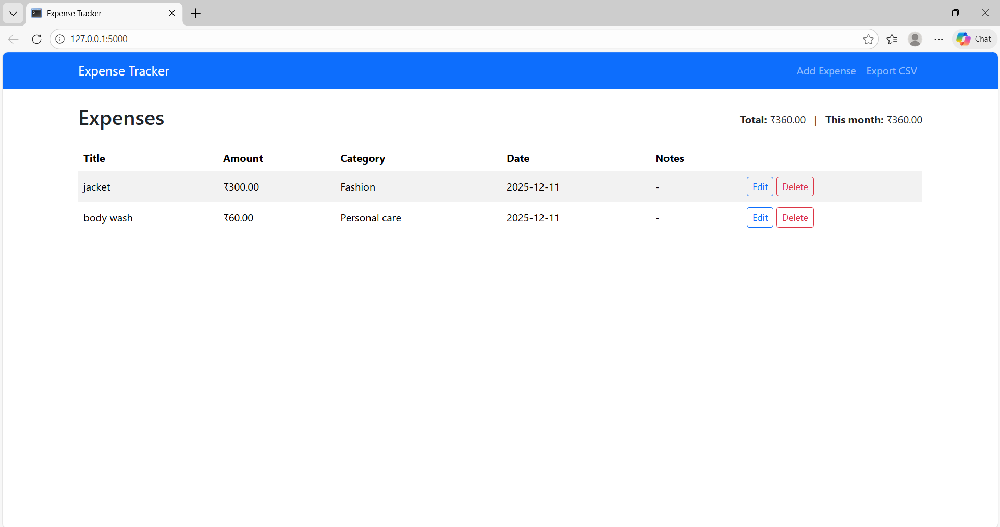

# Expense Tracker Web App

A simple and intuitive **Flask + SQLite Expense Tracker** that allows users to add, edit, delete, and export expenses.  
Built with clean UI, full CRUD functionality, and small analytics (total & monthly totals).

---

## 📸 Preview



---

## 🚀 Features

- Add new expenses (title, amount, category, date, notes)
- Edit & Delete existing expenses
- View all expenses in a clean, responsive table
- Export all data as a CSV file
- Summary analytics:
  - **Total expenses**
  - **Current month's total**
- Mobile-friendly UI using **Bootstrap 5**

---

## 🧰 Tech Stack

- **Backend:** Python, Flask  
- **Database:** SQLite  
- **Frontend:** HTML, CSS, Bootstrap 5  
- **Other:** Pandas for analytics, CSV export  

---
## 📂 Project Structure

```bash
expense-tracker/
│ app.py # Main Flask application
│ db_init.py # Initializes SQLite database
│ requirements.txt # Dependencies list
│ .gitignore
│ README.md
│
├── templates/ # HTML templates (Jinja2)
│ ├── base.html
│ ├── index.html
│ ├── add.html
│ └── edit.html
│
├── static/
│ └── css/
│ └── styles.css
│
├── instance/
│ └── expenses.db # Auto-created on first run
│
└── assets/
└── screenshot.png # Project screenshot
```

---

## 🛠️ Installation & Running the App

### **1️⃣ Create and activate a virtual environment**
```bash
python -m venv venv
venv\Scripts\activate   # Windows
```
### 2️⃣ Install dependencies
```bash
pip install -r requirements.txt
```
### 3️⃣ Initialize the database
```bash
python db_init.py
```
### 4️⃣ Run the development server
```bash
python app.py
```
Open your browser and visit:

👉 http://127.0.0.1:5000/

## 📤 Export Expenses as CSV

Click the Export CSV button in the navbar to download a CSV file of all expenses.

## 📝 Future Enhancements

Add charts (Expense distribution, Monthly totals)

Add searching & filtering options

Add user authentication (login/signup)

Add dark/light theme switch

Multi-user support

## 📜 License

This project is licensed under the MIT [License](LICENSE).


